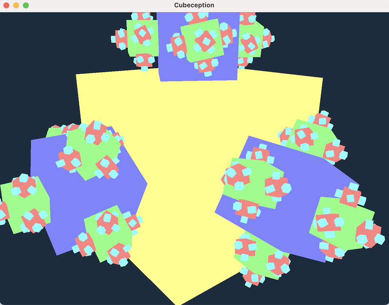

# baryon

Baryon is a compact 3D engine focused on fast prototyping in code.
No big dependencies, no fancy run-times, GUI editors, or other magic.
It's heavily ECS-oriented, and could be used as a foundation for high-level engines.

See [the slides](https://hackmd.io/@kvark/baryon/) from the Rust-GameDev [talk on Feb 2022](https://youtu.be/adt63Gqt6yA?t=1907).

Dependency highlights:
  - [wgpu](https://github.com/gfx-rs/wgpu) for GPU access
  - [winit](https://github.com/rust-windowing/winit) for windowing
  - [hecs](https://github.com/Ralith/hecs) for material ECS

For a similar but more complete experience, with bigger focus on ECS, consider [Dotrix](https://github.com/lowenware/dotrix).
For more features and bigger community, consider [Bevy](https://github.com/bevyengine/bevy).
For better performance and experimental high-tech, consider [Rend3](https://github.com/BVE-Reborn/rend3/).

